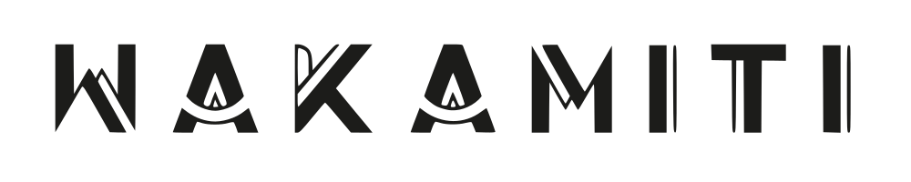
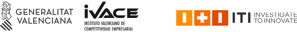

<picture>
  <source media="(prefers-color-scheme: dark)" srcset="./images/logo_wakamiti_dark.svg">
  
</picture>

---

Bienvenido a Wakamiti
----------------------------------------------------------------------------------------------------

**Wakamiti** es una herramienta de pruebas automáticas inspirada en Cucumber, que permite definir pruebas usando 
lenguaje natural con la gramática Gherkin. A diferencia de Cucumber, Wakamiti vincula los pasos a un código 
reutilizable proporcionado por plugins externos, lo que la hace conveniente para probar sistemas a través de protocolos 
estandarizados como servicios web REST o conexiones JDBC. Es totalmente localizable, fácilmente extensible con plugins 
personalizados y se puede ejecutar como un conjunto de pruebas JUnit, un objetivo de verificación Maven o un comando de 
consola.

### Hoja de ruta
Mantente informado sobre las nuevas versiones en las [notas de lanzamiento públicas](/). Sigue el estado actual
[en GitHub](/) y participar en una [discusión](https://github.com/orgs/wakamiti/discussions) si has encontrado un 
posible error, hay una funcionalidad faltante que realmente necesitas, o tienes alguna duda.

### Documentación y tutoriales
Dirígete a nuestra [documentación](https://github.com/wakamiti/.github/wiki).

[//]: # (, y echa un vistazo a nuestro [canal de YouTube]&#40;/&#41; para tutoriales interesantes, historias de desarrollo y actualizaciones de la plataforma.)

Agradecimientos
----------------------------------------------------------------------------------------------------

Este software ha sido desarrollado en el marco del Plan de Actuaciones No Económicas del
**Instituto Tecnológico de Informática (ITI)** para el año 2021, financiado por
el **Institut Valencià de Competitivitat Empresarial (IVACE)** y la **Generalitat Valenciana**,
mediante el convenio de colaboración entre IVACE y el ITI destinado a potenciar su actividad
y capacidades de desarrollo de la excelencia en materia de I+D independiente, difusión
de los resultados de las investigaciones realizadas y transferencia de conocimiento entre las empresas de la
*Comunitat Valenciana*.

<picture>
  <source media="(prefers-color-scheme: dark)" srcset="./images/footer-dark.png">
  
</picture>

